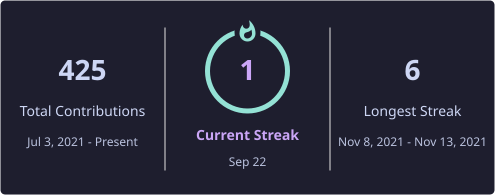

# Hi, I'm Damian 👋

### FullStack Web Developer · Freelance @ [Ryōma Development](https://ryomadev.com)

Building fast, accessible, and visually intentional websites — from La Plata, Argentina 🇦🇷

---

### 🚀 About me

I'm a solo freelance developer working under my own brand, **Ryōma Development**, building websites and web apps for clients across Spanish-speaking (Workana) and global freelance markets. I care as much about *how fast and accessible* a site is as I do about how it looks.

- 🔭 Currently building **InspectIA**, an AI-powered SaaS tool that automates property inspection report generation for home inspectors
- 🎨 Iterating on my own portfolio (this repo's sibling 👉 [`ryoma-portfolio`](https://github.com/DCastroAndrich/ryoma-portfolio)), obsessing over Lighthouse scores and accessibility details most people skip
- 🌱 Exploring self-hosted automation with n8n + the Claude API for personal productivity tooling
- 🐧 Daily driver: **Manjaro Linux**, KDE Plasma, Catppuccin Mocha theme
- 💬 Working in both Spanish and English

### 🧰 Tech I work with

**Frontend**

**Backend & Tooling**

### 📊 GitHub Stats

---

📫 Reach me at **[ryomadev.com](https://ryomadev.com)** or on **[LinkedIn](https://linkedin.com/in/dcastroandrich)**

